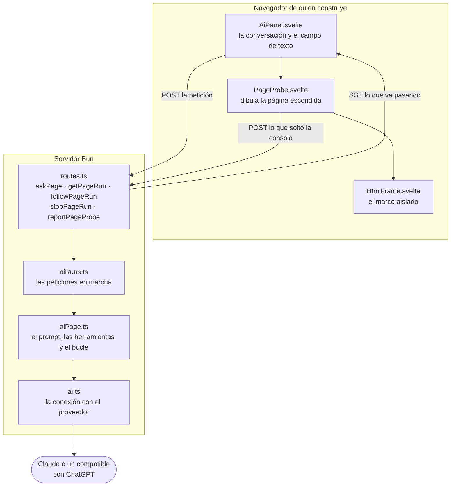
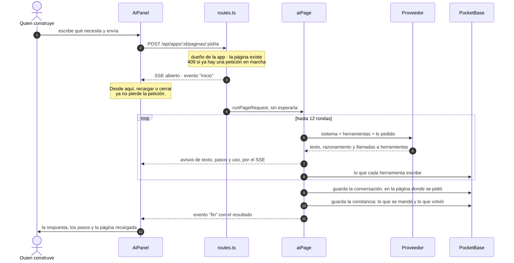
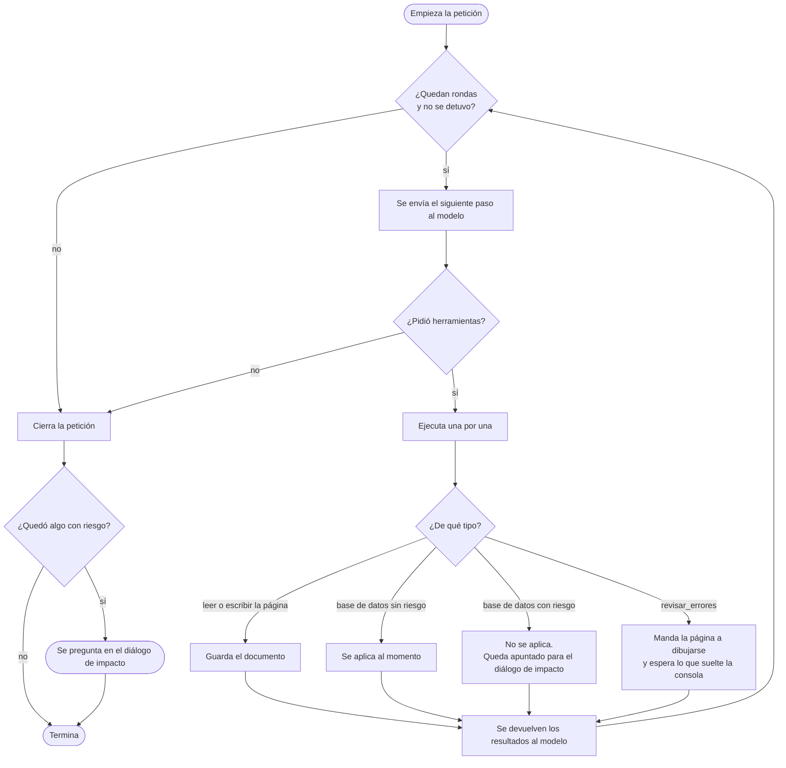
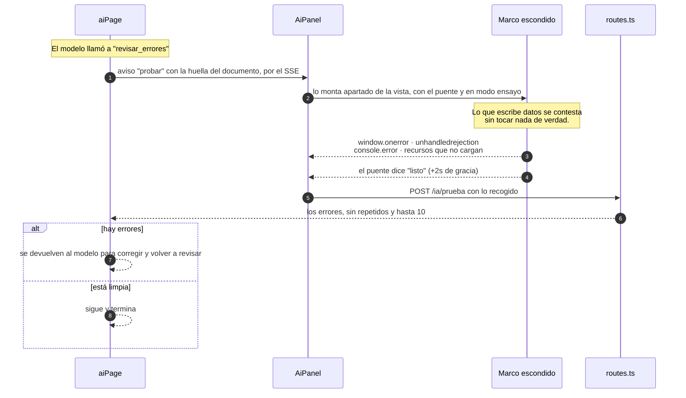

# El chat de IA

Cómo funciona una petición a la IA, de principio a fin. Dibujado en [Mermaid](https://mermaid.ai/): GitHub y la mayoría de los editores lo renderizan solo.

> Para lo demás: el [README principal](../README.md) cuenta qué es Planer, y [PAGINAS-HTML.md](./PAGINAS-HTML.md) explica cómo se escribe el HTML de una página.

Una petición escribe sobre **una sola página**: la que está abierta. Cuatro ideas explican casi todo lo demás:

- **La petición no vive en la conexión que la pidió.** Vive en el servidor, en memoria del proceso. Recargar, cerrar el panel o volver más tarde no la corta.
- **El servidor no tiene navegador.** Lo único que necesita ejecutar HTML de verdad —revisar errores— se le pide al navegador de quien construye.
- **La conversación es de la página**, no de la aplicación. La lista del dock muestra solo las de la página abierta, y borrar la página se las lleva.
- **Abierta hay una sola en toda la aplicación**: la última en la que se habló. La apunta la aplicación (`apps.openChat`), así que llegar a una página repone esa conversación solo si es la suya y las demás empiezan en blanco —también al volver desde otro navegador—. Lo de antes sigue a un clic, en «Conversaciones anteriores».

Desde el panel se pide en **una página a la vez**: mientras se trabaja en una, el dock de cualquier otra no admite peticiones y ofrece ir a la que está en curso. El límite vive ahí y solo ahí —`aiRuns` sigue admitiendo una petición por página y varias páginas a la vez—, así que levantarlo es quitar esa condición del panel.

## Las piezas

`AiPanel` es la única entrada del chat. `aiRuns` es donde vive la petición mientras el navegador va y viene.

## Una petición de principio a fin

Lo que llega antes del final es **para mirar**. El resultado de verdad llega una sola vez, en `fin`.

## La constancia de cada petición

Al cerrar el turno —termine bien o mal— se guarda en `ai_debug` lo que se le mandó al modelo, lo que pensó, lo que respondió, con qué modelo y cuánto tardó. **Una fila por página**, sobrescrita en cada petición: no es un historial, es lo que hace falta para entender después un fallo que no se puede reproducir.

Se guarda siempre, sin depender del modo debug: si hubiera que encenderlo y repetir la petición, llegaría tarde justo para el fallo que vale depurar. Se escribe después de entregar el resultado, y que falle no cambia lo que recibe quien construye.

Se lee desde el despliegue «Contexto enviado» de la conversación, así que recargar después de un fallo no lo pierde. Borrar la página se lleva su constancia; los ajustes generales ofrecen borrarlas todas de una vez.

## El bucle de rondas

Tope de **12 rondas**. Detener corta **entre herramientas**, nunca a media escritura: lo ya aplicado se queda aplicado, y para deshacerlo está el punto de vuelta atrás que se deja una sola vez por petición.

Los cambios con riesgo (borrar una columna, borrar una tabla, cambiar un tipo) nunca se aplican solos: se apuntan y se preguntan todos juntos al terminar, en el diálogo de impacto.

## Revisar errores

El único camino que va del servidor hacia el navegador y espera respuesta. El servidor no tiene dónde ejecutar HTML, así que se lo pide a quien sí lo tiene abierto.

| Situación | Qué pasa |
|---|---|
| Nadie está mirando el panel | Espera 15 s, vence, la petición recibe "no se pudo probar" y continúa. |
| El documento nunca dice estar listo | Tope duro de 12 s, se cierra con lo recogido hasta ahí. |
| El modelo insiste | Dos revisiones por petición; a la tercera se le dice que pare y lo cuente. |
| Un error que solo salta al pulsar un botón | No se ve — esto solo mira lo que pasa al cargar. |
